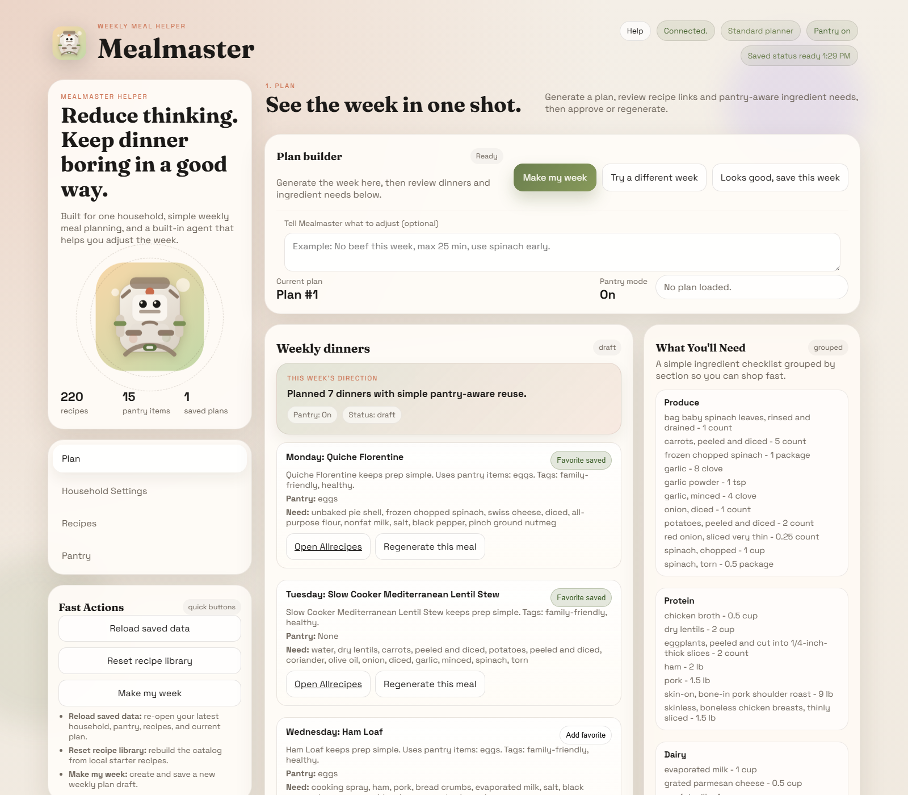
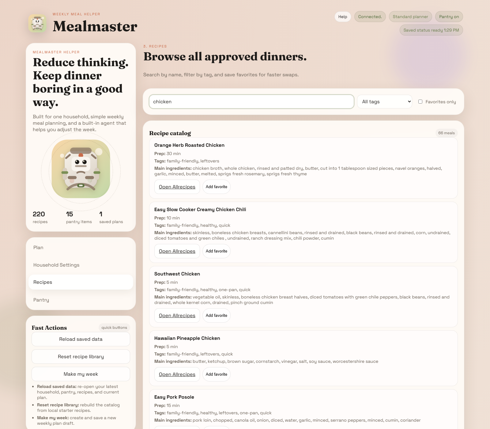
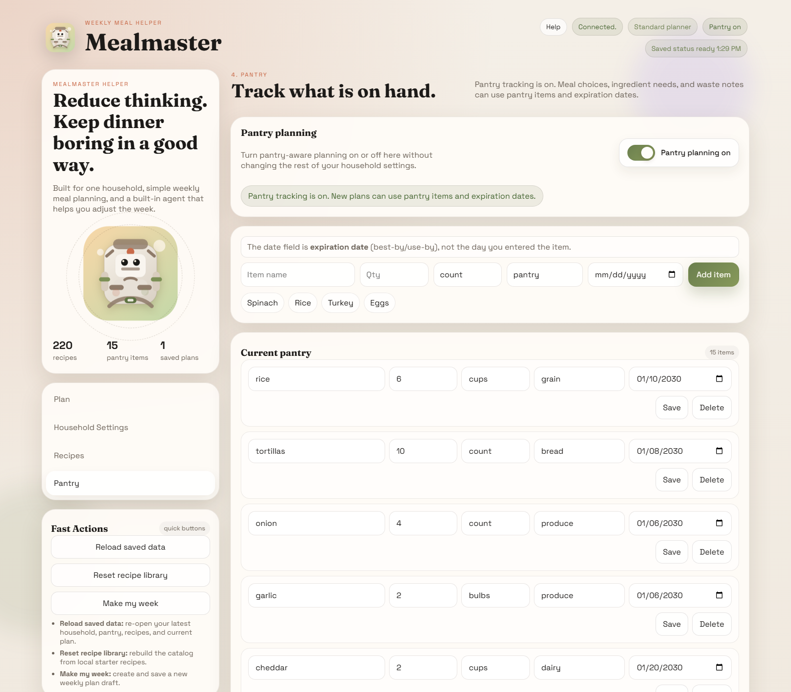
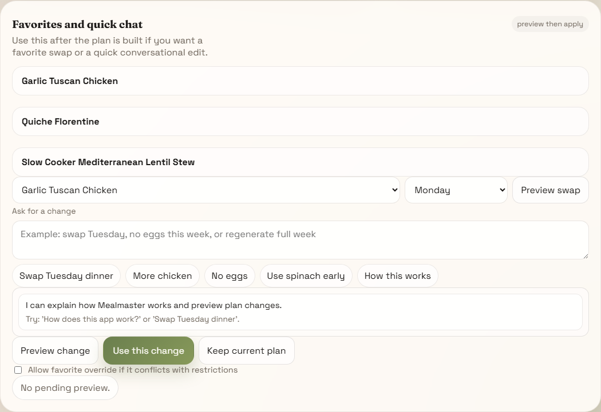

# Mealmaster

  

<strong>Practical weekly meal planning for a real household.</strong>

Simple dinner plans. Optional pantry tracking. A built-in planner that helps without taking over.

This repository is the public download page for Mealmaster releases.
It is not the source code repository.

## Download

Get the latest Windows build here:

- [Latest release](https://github.com/bitofastickler/mealmaster-releases/releases/latest)

Download the main app file from the latest release:

- `Mealmaster.exe`

## What Mealmaster Does

- Creates a 7-dinner weekly plan
- Keeps household preferences simple and editable
- Supports optional pantry-aware planning
- Lets you favorite recipes and refine the week
- Stores your data locally on your machine

## Screenshots

### Weekly plan overview

### Recipe browser

### Pantry tracking

### Favorites and quick chat

## Why It Exists

Mealmaster is built for the common problem of knowing roughly what your household likes but still not wanting to think through dinner every night.

The goal is not gourmet cooking.
The goal is getting to a workable week faster.

## Windows Setup

1. Download `Mealmaster.exe` from the latest release.
2. Run the file.
3. If Windows shows a trust warning for an unsigned app, continue only if you trust the download source.
4. Use the app locally on your machine.

## Privacy

Mealmaster is designed for local use.
Your saved household, pantry, and planning data stay on your machine unless you choose to host or deploy the app somewhere else.

Some builds may support optional AI-backed planning behavior depending on configuration.

## Support

Use the `Issues` tab for:

- install problems
- bug reports
- feature requests

Please do not post API keys, private household information, or other secrets in public issues.

## Terms

Mealmaster is free to download and use under the terms included with each release.
This repository does not provide access to the private source code.

## Release Notes

Each release includes:

- what changed
- anything to know before updating
- known issues

## Look and Feel

Mealmaster is intentionally planner-first:

- one household
- one clear weekly plan
- pantry support when you want it
- quick conversational edits without turning the app into a general chatbot
